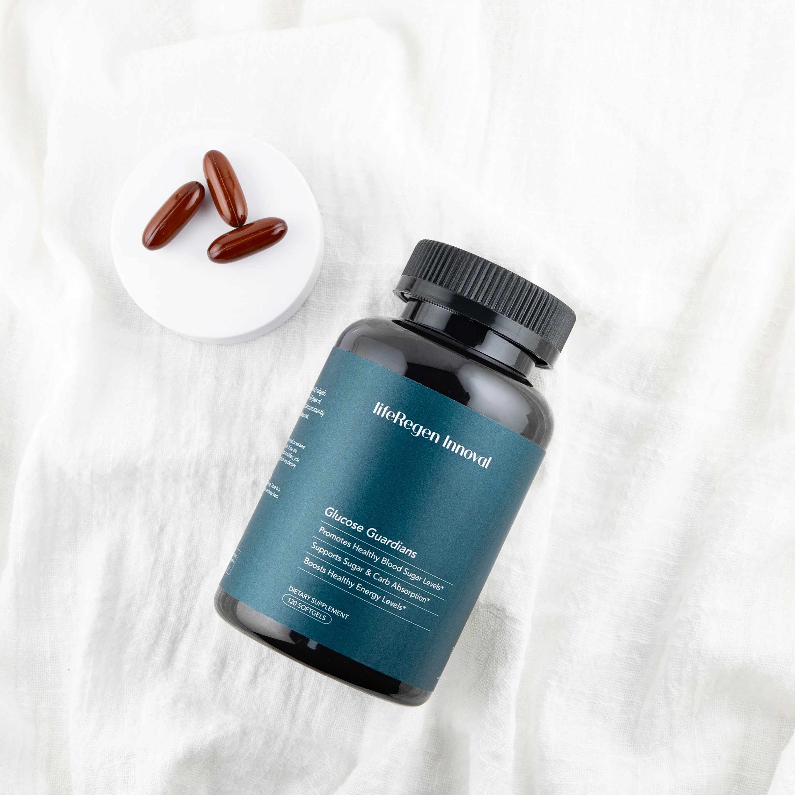

Innoval是一款前沿健康產品，結合東方中藥智慧與西方尖端科技，旨在促進全身健康與抗老化功效。專為追求全方位健康支持的人士設計，Innoval提供您體內外的全面保養。

<!--more-->

## 主要特點

- **促進細胞活化**：幫助提升細胞再生能力，延緩老化跡象。
- **加強免疫功能**：提高身體對外部威脅的抵抗力，支持長期健康。
- **抗氧化支持**：減少自由基傷害，保護細胞完整性。
- **提升皮膚質量**：促進肌膚緊緻和光澤，展現自然年輕。
- **全方位營養**：包含多種關鍵成分，支持整體健康與活力。

## 使用方法

每日服用2顆，建議與餐食一起服用，以確保最佳吸收效果。

## 健康支持的科學基礎

Innoval由LifeRegen™專家團隊研發，融合中醫藥學與西方生物科學。它專注於提升細胞功能，從而支持全身健康。創新的配方針對人體自然老化過程，幫助改善內在機能，延緩衰老。

## 核心成分與作用

Innoval的配方由精選成分組成，包括：

專利混合物：腸胃道保護劑（芝麻籽油、蜂蠟）、黃柏提取物、米糠提取物。其他成分：牛明膠、甘油、水、焦糖色

## 為什麼選擇Innoval？

LifeRegen™ Innoval不僅僅是一種保健產品，而是健康生活方式的象徵。透過自然與科技的結合，Innoval為您的身體提供所需的養分，幫助您迎接每一天的挑戰，並以最佳狀態面對未來。

## 購買資訊

- **價格**：US$120 ≈ NT$3800
- **購買連結**：[立即購買](https://liferegen.com/zh-hant-tn?sponsor=tw011020)

## 聯絡資訊

如有任何問題或需要進一步的資訊，請聯絡我們：

- **LineID**：rk313131
- **電話**：[撥打 0937834975](tel:0937834975)
- **電子郵件**：[zosakuo@gmail.com](mailto:zosakuo@gmail.com)

## 結論

Innoval是促進健康與抗老化的理想選擇，幫助您展現自信與活力。立即體驗LifeRegen™ Innoval的與眾不同吧！